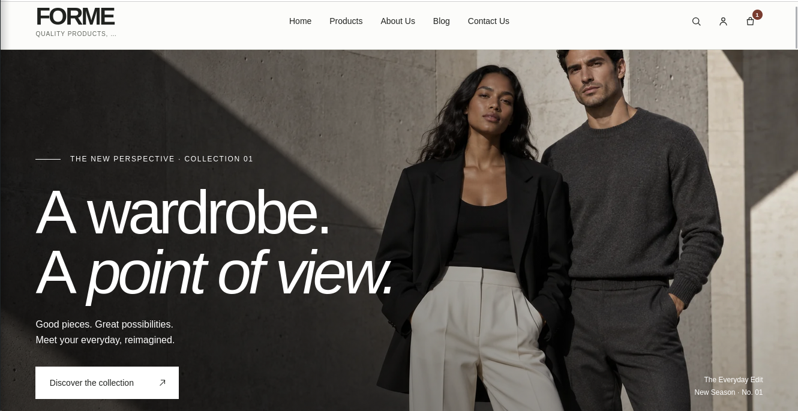
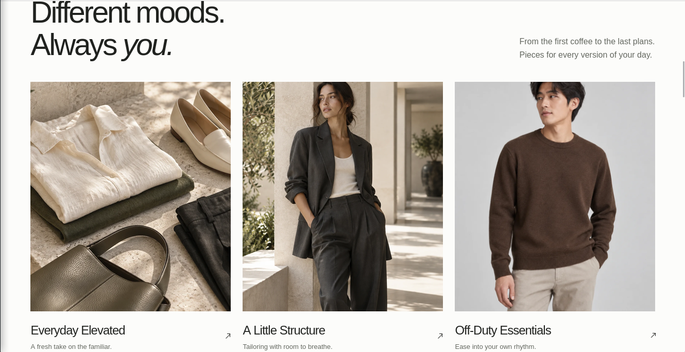
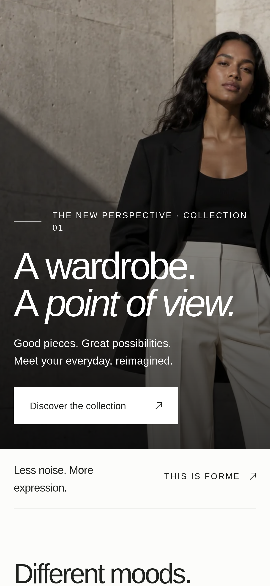
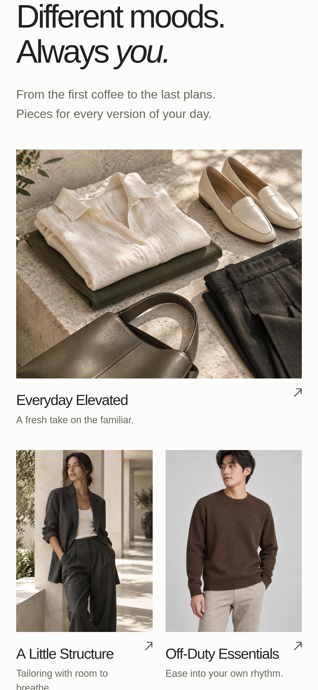

# FORME Fashion Ecommerce CMS Lite

> 🚀 **Want the full version?** Stripe, PayPal, Google Sign-In, SMTP, 
> white-label ready → [Get the Full Edition on Whop](https://whop.com/burhan-builds/fashion-store-cms-for-developers/)

A free, reusable **Node.js ecommerce CMS starter** for fashion, clothing and apparel stores.

Built with **Node.js, Express, EJS and MongoDB**, with the original responsive FORME storefront design preserved in the Lite edition.

## Screenshots

### Storefront


### Collections


### Editorial Storefront Section


### Mobile Storefront


### Mobile Collections


## Features

- Secure admin setup and login
- Product add/edit/delete
- Categories
- Local product image uploads
- Basic stock management
- Responsive fashion storefront
- Product search and category filtering
- Shopping cart
- Guest checkout
- Cash on Delivery / manual orders
- Admin order management
- Order status updates
- Server-side stock and price checks
- Basic SEO meta tags

## Tech Stack

**Node.js · Express.js · MongoDB · Mongoose · EJS · HTML · CSS · JavaScript**

## Lite vs Full Version

FORME Lite includes the essential ecommerce workflow while keeping the storefront design intact.

The **Full Edition** adds advanced features such as:

- Theme and appearance customization
- Homepage builder and custom sections
- Customer accounts and Google login
- Stripe & PayPal
- Coupons and discounts
- Product bundles
- Wishlist and reviews
- Blog CMS
- Advanced variants and inventory
- Cloudinary
- Email/SMTP
- CSV import/export
- Backup & restore
- Advanced SEO controls
- Analytics and revenue reports
- Additional CMS settings


## Quick Start

```bash
npm install
```

Copy `.env.example` to `.env` and configure `MONGODB_URI` and `SESSION_SECRET`.

Then run:

```bash
npm start
```

Open:

```text
http://localhost:3000/admin/setup
```

Create the administrator, add a category and start adding products.

## Product Images

Lite uses local product image uploads.  
Supported formats and upload limits are handled by the included image service.

## Checkout

FORME Lite uses **guest checkout** with Cash on Delivery / manual order placement.

No customer account is required.

---

If you find FORME Lite useful, consider giving the repository a **⭐ star**.
